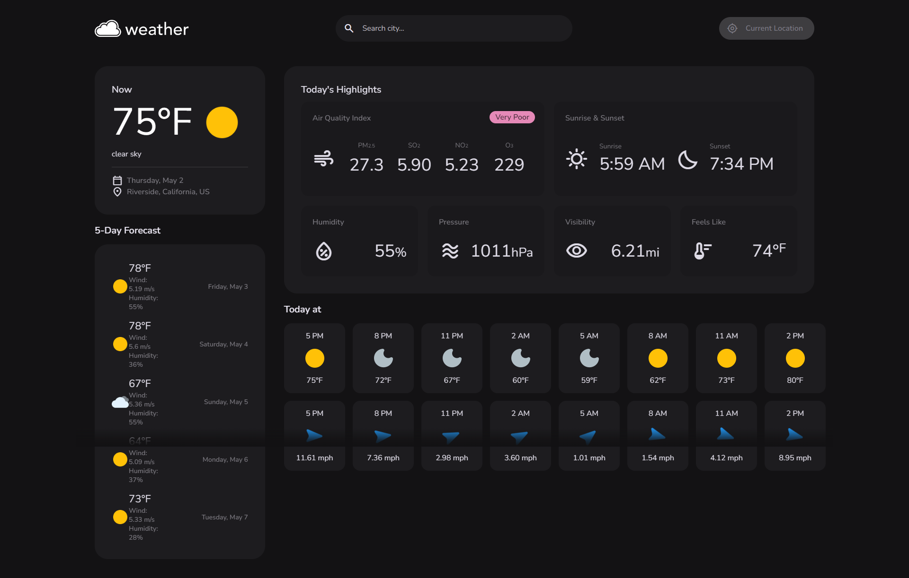

# Weather Machine

 

## Desciption 

The Weather Machine app is a user-friendly tool designed to provide travelers with up-to-date weather information for multiple cities, helping them plan their trips more effectively. With an intuitive interface and comprehensive features, users can quickly access current weather conditions and future forecasts for their desired destinations.

## Usage

1.  <u>Search for a City</u>: Enter the name of the city you want to check the weather for in the provided search bar.
2.  <u>View Current Weather</u>: Upon searching, you'll see the current weather conditions for the selected city, including temperature, humidity, and wind speed.
3.  <u>Plan Ahead</u>: Scroll down to view the 5-day forecast, helping you plan your trip with insights into upcoming weather patterns.
4.  <u>Search History</u>: Easily access previously searched cities by clicking on them in the search history section.

The following image shows the web application's appearance and functionality: 

[Visit my website](https://haartmuhn.github.io/weather-machine/)

## License 

[MIT License](https://opensource.org/licenses/MIT)